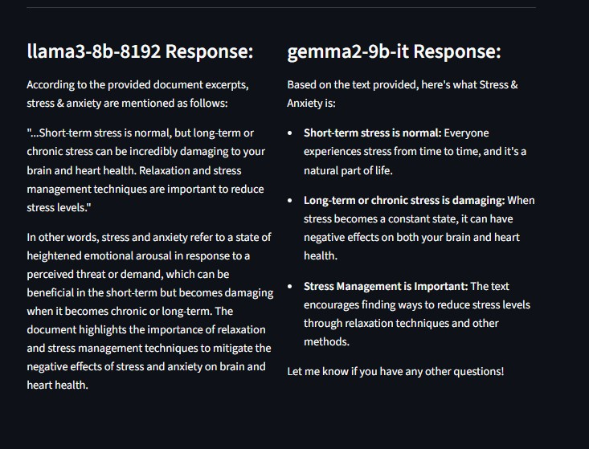

# Mini RAG Project with LLM Comparison

This project implements a Retrieval-Augmented Generation (RAG) system that:
- Ingests PDF documents,
- Break the text into small, meaningful pieces that keep the original semantics,
- Generates embeddings using SentenceTransformers,
- Stores embeddings in a vector database (ChromaDB),
- Retrieves relevant chunks for user queries,
- Queries multiple Large Language Models (LLMs) via Groq API,
- Displays side-by-side responses in a Streamlit UI for comparison.

---

## Features

- PDF text extraction with PyMuPDF  
- Sentence-aware chunking (200-300 words per chunk)  
- Embedding generation with `all-MiniLM-L6-v2` model  
- Vector search with ChromaDB  
- Dynamic model selection for LLM querying  
- Side-by-side LLM response comparison  
- Streamlit web interface with caching to optimize performance  

---
## Example Output

### UI Screenshot


### User Query


### LLM Response / Output

---

## Setup Instructions

### 1. Clone this repository

```bash
git clone <your-repo-url>
cd <your-repo-folder>
```
### 2. Install dependencies
```bash
pip install -r requirements.txt
```

### 3. Configure environment variables
Create a .env file in the root directory with your Groq API key:
```bash
GROQ_API_KEY=your_groq_api_key_here
```

### 4. Run the Streamlit app
```bash
streamlit run streamlit_app.py
```
---
## Usage Workflow
- Click Load and Process PDFs to extract, chunk, embed, and store document data.

- Enter a question in the input box.

- Select two LLM models from the dropdown menus to compare.

- Click Get Answer to retrieve relevant document chunks and view side-by-side model responses.

---

## Project Structure
- streamlit_app.py: Streamlit UI and main app logic

- data_ingest.py: PDF text extraction, chunking, and embedding storage

- retriever.py: Query embedding and finds the most similar text chunks

- llm.py: Groq LLM API calls and response parsing

- data/: Sample PDFs used for ingestion

- .env: Environment variables file (not included in repo)

- requirements.txt: Project dependencies
---
